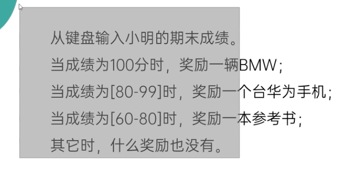
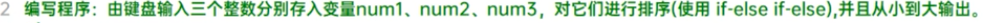
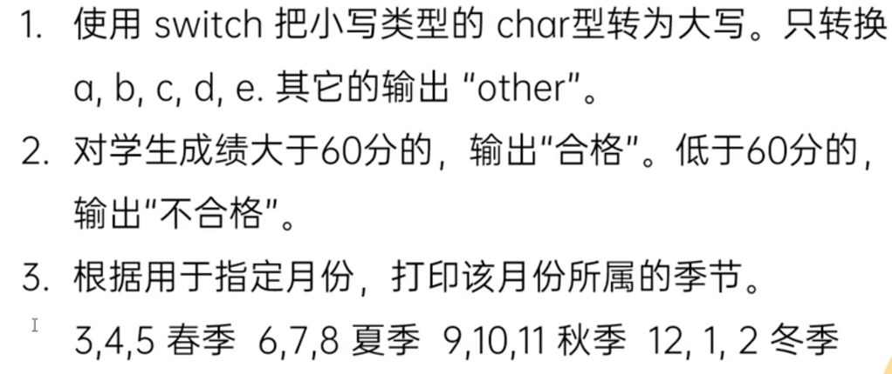
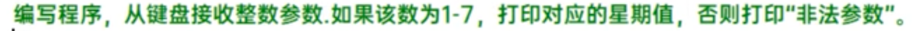
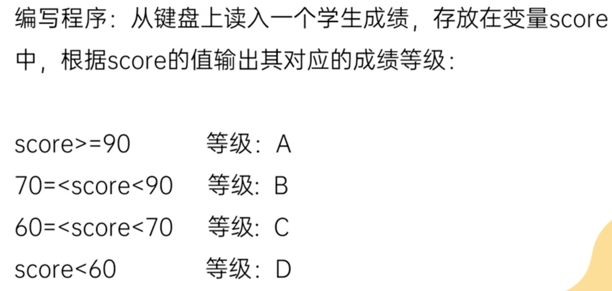
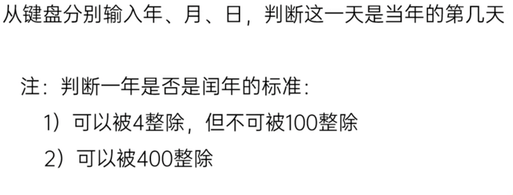
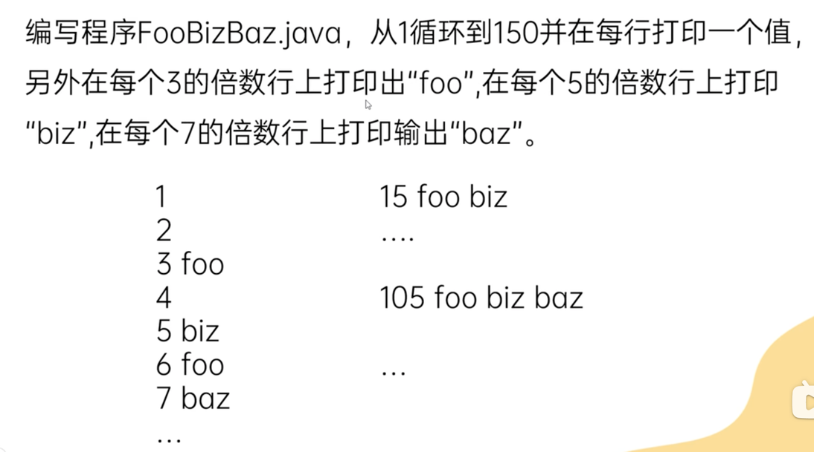
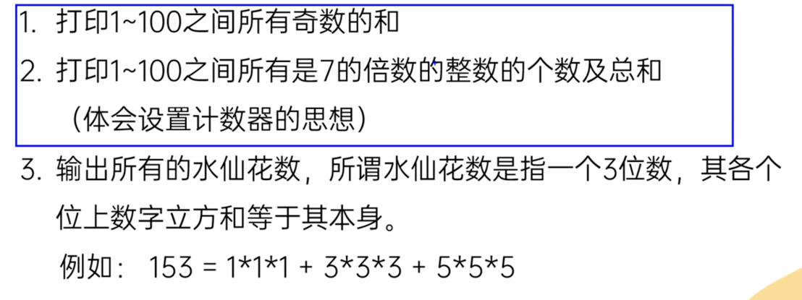
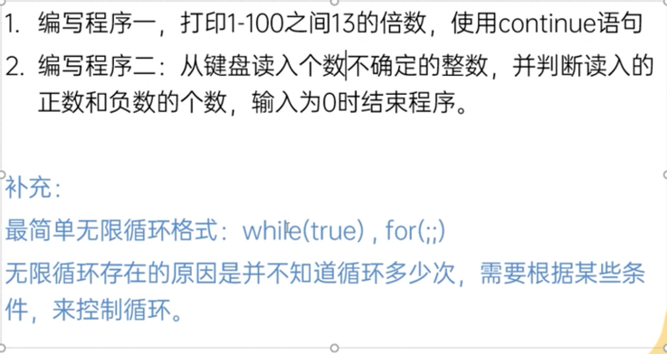

#语法

##条件判断 If
- 没有nextChar()
- 注意使用多层if/else if时，条件语句的范围应由小到大
- 不用 == 比较两个字符串，应使用equals()

###练习
practice1: 
practice2: 
practice3: 

##选择结构 Switch
基本结构 `switch(expr) {
        case one: 
            executed code
            break;
        case two:
            executed code
            break;
        ……
        default:
            executed code
            break;
}`

- 如果expr的值不和任意case相等，则执行default里的语句
- expr 返回结果的数据类型只能是byte, short, int, char, String(after jdk1.7), enum
- default case is **optional**
- expr返回结果的数据类型必须和case 值的类型一致
- break is **optional** as well, see the 4th test
- case 后只能写**常量值**，不能写表达式
- 对比if和switch: 区间和布尔类型判断用if，switch判断的类型有限，但效率更高 （see the 3rd practice in this note）

###练习 (see ChoicePractice2.java)
- 
- 
- 
- 

##循环 For
- while 和 do while 的区别：
  - do while 先执行do里的语句，后判断，如果不再符合判断条件，不再继续循环，至少执行1次
  - while是先判断，如果不符合条件，不执行任何语句
- 嵌套for循环：外层循环控制行，内层循环控制列 
- 给特定循环加标签eg. label: for(……)，用break/continue label时可以直接跳出指定循环
- break label 还可以结束指定代码块
- 无限循环`while(true) do {} == for(;;)`
###练习
-  (see FooBizBaz.java)
-  (see ForPractice.java)
- practices related to nested loop pls see NestedLoop.java
- 