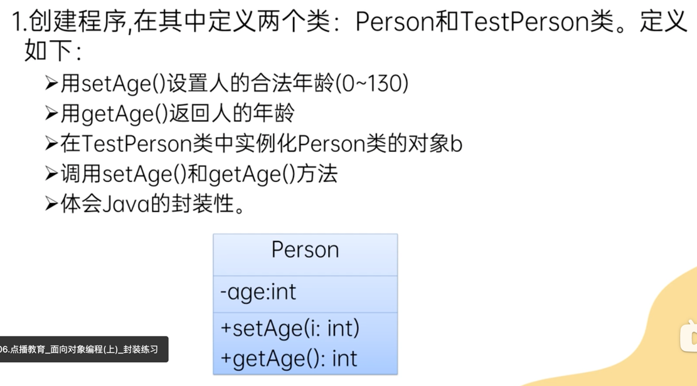
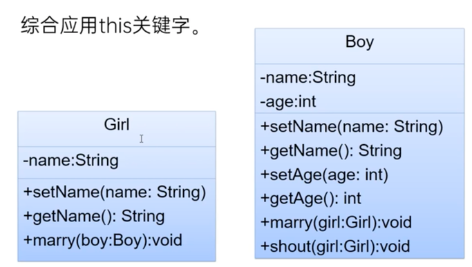

# Encapsulation 封装性（oo的特性之一）
=======================================
## 封装性
- 把该隐藏的隐藏，该暴露的暴露
## 访问控制修饰符
- public: 修饰属性，方法，类。在任何地方都可被访问
- private: 修饰属性，方法。只能在本类中被访问
## 封装的步骤
1. 属性私有化，private修饰属性
2. 提供公共的设置和访问方法，public setter and getter
## this 关键字
- 使用在本类中，代表当前对象，可用于调用当前对象的属性，方法，构造器
- 在方法中区分成员变量和局部变量，`this.age = age;`
- this调用本类的构造器`this(参数列表) :`  (see ThisConstructor.java)
    - 注意⚠️
  1. this 调用构造器时，调用构造器的语句必须写在构造器中的可执行代码的首行
  2. this调用构造器时，不可以互相调用，避免递归构造器调用
## 练习
- practice 1: see Main.java
- practice 2
- practice 3: 
- practice 4: see MarryTest.java 
- practice 5: see ThisConstructorPractice.java 
- final practice:   