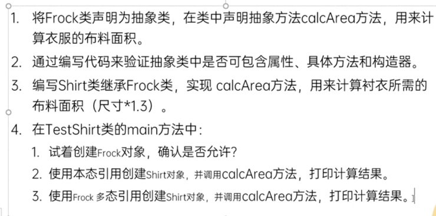

# Abstract Class 抽象类

## 是啥❓
- 当父类声明了方法，但是还不知道子类想怎么实现方法的时候，这个类则须为抽象类
- 父类中只做声明，而不做实现的方法应该用`abstract`关键字修饰
- 拥有一个或多个"抽象方法"的类，我们就称其为"抽象类"

## 咋用❓
### `abstract class` 抽象类
格式：`访问控制修饰符 abstract class {}`

### `abstract method` 抽象方法
格式：`访问控制修饰符 返回值类型 abstract 方法名(参数列表);`
⚠️没有方法体

## 注意⚠️
- 抽象类中可以有"非抽象方法"，也可以没有"抽象方法"
- 抽象类不能**创建实例**
- 子类继承父类（抽象类），那么必须**重写**父类的**所有**的抽象方法，因为子类继承了父类的所有（抽象）方法
- `abstract`和`final`不能同时使用，因为`final`类和方法被能被继承，和`abstract`必须被继承这一特性相悖
- `abstract`和`static`不能同时使用，因为`static`方法随着类的加载而被加载，也就意味着没有方法体的`abstract class`可以通过`类名.方法名()`去调用，which doesn't make any sense
- `abstract`和`private`不能同时使用，因为子类无法使用`private class`，无法对其进行重写

## 练习
- see /practices 