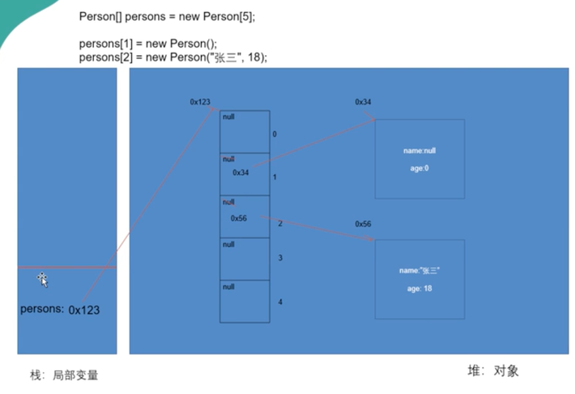
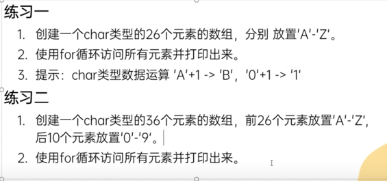
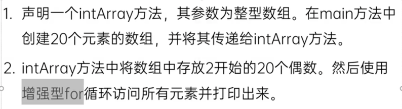
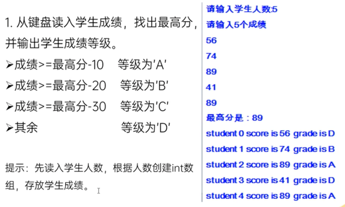
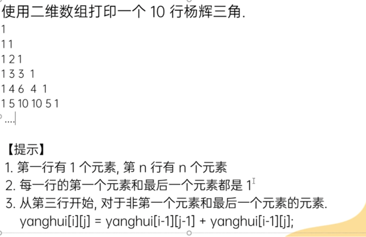
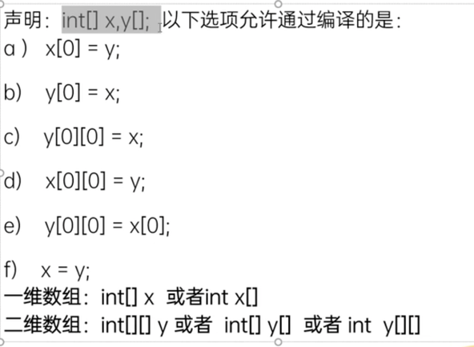
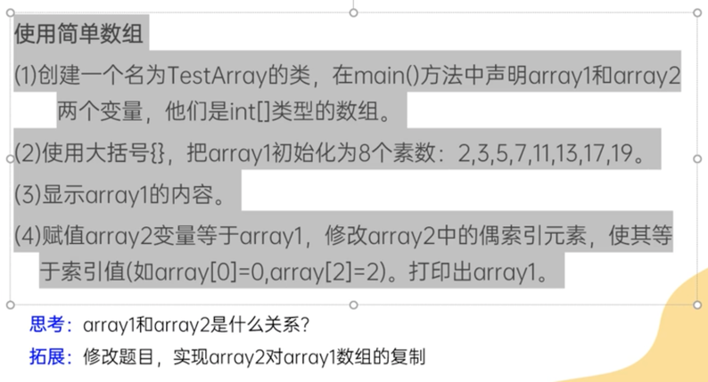

# 数组
## 一维数组
- 用于批量保存一类数据，是一种引用数据类型
- 数组的默认值根据数组元素的类型不同而有不同的默认值
- 数组在内存 中是一块连续的内存空间
- 一个数组对应一个地址值
- 

### 初始化
- 静态初始化：初始化操作和赋值操作同时进行
  - 初始化时指定数组的长度是在{}中列出元素，列几个长度就是几个
  - ```scores = new int[] {11, 22, 33, 44, 55};```
- 动态初始化：初始化操作和赋值操作分开进行
  - 初始化时在[]里指定数组长度
      ```
        names = new String[5];
          names[0] = "Jane";
          names[1] = "Wang";
          names[2] = "Momo";
          names[3] = "Wu";
          names[4] = "Ran";
      - ```

### 数组的反转
```
        for (int i = 0; i < array1.length; i++) {
            int temp = array1[i];
            array1[i] = array1[array1.length - 1 - i];
            array1[array1.length - 1 - i] = temp;
        }
```

### 数组的排序
- 冒泡排序 see BubbleOrderedTest.java
  利用两层循环去排序，外层循环控制比较多少轮，内层循环控制每轮比较多少次
- 简单选择排序
  see SelectionOrderedTest.java
- 使用java提供的工具类 `java.util.Arrays`排序

### 注意⚠️
  - 初始化的两种写法：`int[] names;` or `int names[]`
  - 数组长度一旦确定，无法再增加长度或者减少长度，扩容只能new一个新的数组，重新设定长度，并将旧数组的元素赋值到新数组上
  - 将数组元素的值赋给另一个数组的元素时，不可以直接用`array1[] = array2[];`而要用
  ```
  for (int i = 0; i < array1.length; i++) {
    array2[i] = array1[i];
    }
  ```

## 二维数组
- 数组里的元素的类型还是数组 eg. int[][]
### 初始化
- 静态初始化
  - `arr = new int[][] {{1,2,3}, {2,5,7}, {3,9,0}};`
- 动态初始化
  - 方式一：
  ```
    arr = new int[5][6]; // new一个size为5的二维数组，二维数组的元素是size为6的一维数组
    // look like this -> {{0,0,0,0,0,0}, {0,0,0,0,0,0}, {0,0,0,0,0,0}, {0,0,0,0,0,0}, {0,0,0,0,0,0}}
    arr[0][2] = 11;
    // now the array is -> {{0,0,11,0,0,0}, {0,0,0,0,0,0}, {0,0,0,0,0,0}, {0,0,0,0,0,0}, {0,0,0,0,0,0}}
  ```
- 方式二：
  ```
  arr = new int[3][];// new一个size为3的二维数组，但是不初始化二维数组的元素，即一维数组
  // look like this -> {null, null, null}
  arr[0] = new int[3];
  // then arr will look like this -> {{0,0,0}, null, null}
  // 二维数组里的元素，即一维数组可以是不同size的
  arr[2] = new int[4];
  // then arr will look like this -> {{0,0,0}, null, {0,0,0,0}}
  arr[0][1] = 11;
  // then the arr will look like this -> {{0,11,0}, null, {0,0,0,0}}
  ```
  
### 循环遍历二维数组
- see ArrayPractice4.java
## 练习
- practice 1: 
- practice 2: 
- practice 3: 
- practice 5: 
- practice 6: 
  `int[] x,y[] -> int[] x; int[] y[]`
  a) ❌ b) ✅ c) ❌ d) ❌ e) ✅ f) ❌
- practice 7: see TestArray.java 