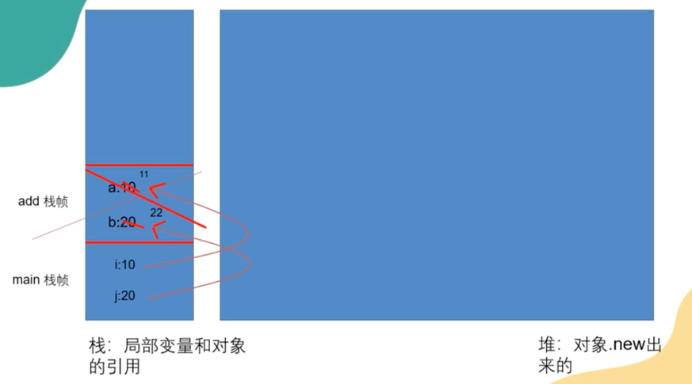
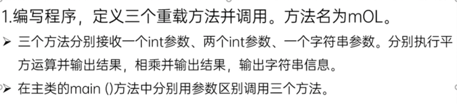
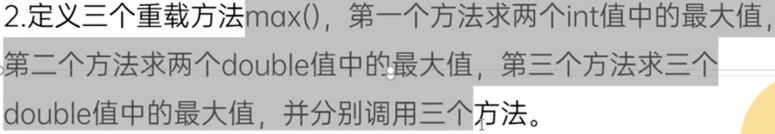

##方法的声明和调用

###方法也叫函数：功能的定义，一个类中最基本的功能单元
- 方法中只能调用其他方法，不能声明新的方法
- **！！基本数据类型作为参数传递**将定义的变量作为参数传入调用的方法中后，变量的值在方法调用结束后不会被改变
  - 内存空间：
    - 栈：存局部变量和对象的引用
    - 堆：存new出来的对象
    - see MethodPractice.java - practice 2 

- 方法的重载 Overload (参数列表不同的同名方法)
  - 方法名和参数列表相同，但返回类型不同时，无法构成方法重载，因为jvm无法通过参数列表判断调用的是哪个方法

###练习
- practice 1: 
- practice 2: 
