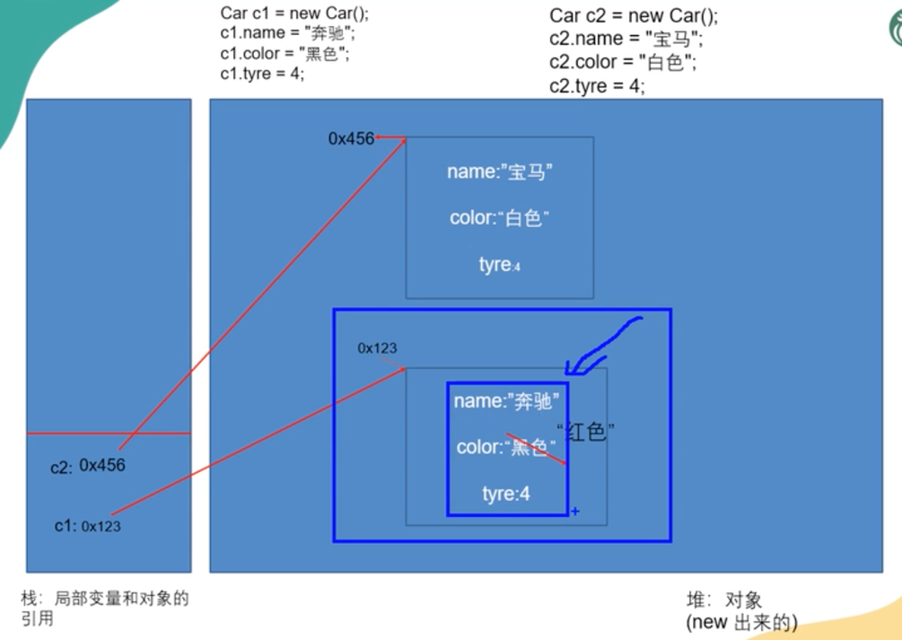

##Object Oriented Programming
- 对象的属性也叫成员变量/实例变量
- 
- 成员变量和局部变量的区别：
  - 作用域不同。成员变量作用于整个类中，在同一个类下的方法也可以使用；局部变量只作用于声明他的方法中 
  - 在内存中的位置不同。成员变量被存在栈中，局部变量被存于堆中
  - 默认值。成员变量有默认值；局部变量没有默认值（使用前需赋初始值）
- 属性的默认值：
  - 基本数据类型：
    - byte, short, int -> 0
    - long -> 0L
    - float -> 0.0F
    - double -> 0.0D
    - char -> '/u0000' (空值的意思)
    - boolean -> false
  - 引用数据类型：-> null
    - class
    - interface
    - array []
- 对象被new出来后在堆中，属性首先被赋以默认值，而后才被手动赋上其真实值
- 创建对象类里的属性时，也可直接设置其值

###练习
- practice 1: 
- practice 2: 
- practice 3: 