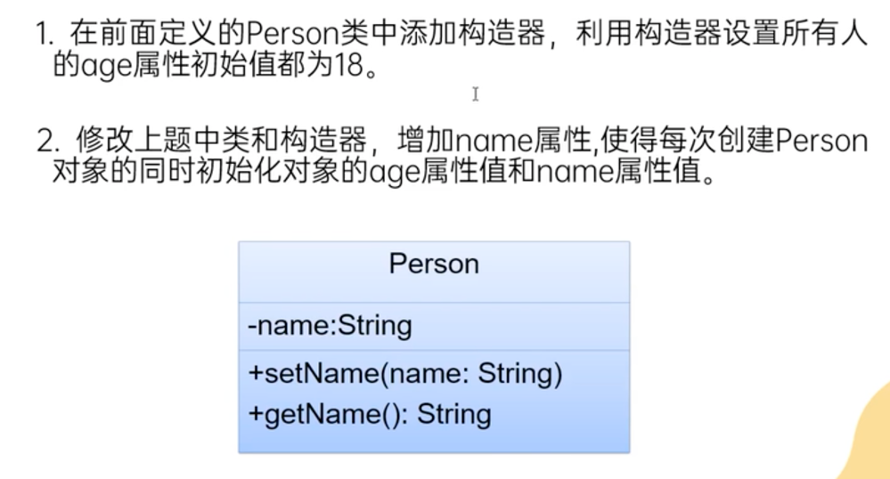
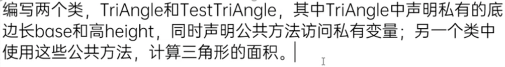

# Constructor 构造器/构造方法

## 是什么❓
- 和属性，方法一样，是类的成员之一
## 格式❓
```
访问控制修饰符 类名() {
    功能语句
}

public Person() {
    System.out.println("This is the constructor.")
}
```

## 作用❓
1. 用于创建对象 -> 当new 一个对象时，构造方法中的功能语句就会被执行 (see practice 1)
2. 为对象进行初始化 -> 即对象一旦被实例化，他就具备了属性和行为 (see practice 2)
3. 为属性赋初始值 (see practice 3)

## 注意⚠️
- 当构造方法没有被手动生成在类中时，我们仍然可以new对象是因为系统会自动生成一个**无参**且**访问修饰符与类一致**的构造方法
- 当类中显示提供了任一构造方法，系统将不再提供默认的无参构造方法 
- 构造器之间可以构成重载，在同一个类中： 
  - 构造器的名称必须相同
  - 造器的参数列表必须不同
- 构造器中也可以调用方法 see practice 4 in ConstructorTest.java

## 为属性赋初始值的方式有几种❓
1. 默认值（也叫缺省值）
2. 直接显示赋值
3. 构造器赋值
### 这三种赋值方式的执行顺序❓
默认值 -> 直接显示赋值 -> 构造器赋值

## 练习 (see ConstructorTest.java)
- final practice 1: 
- final practice 2: 