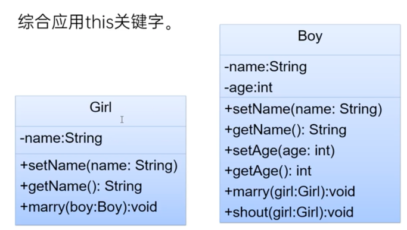

# Encapsulation 封装性（oo的特性之一）
=======================================
## 封装性
- 把该隐藏的隐藏，该暴露的暴露
## 访问控制修饰符
- public: 修饰属性，方法，类。在任何地方都可被访问
- private: 修饰属性，方法。只能在本类中被访问
## 封装的步骤
1. 属性私有化，private修饰属性
2. 提供公共的设置和访问方法，public setter and getter
## this 关键字
- 使用在本类中，代表当前对象，可用于调用当前对象的属性，方法，构造器
- 在方法中区分成员变量和局部变量，`this.age = age;`
## 练习
- practice 1: see Main.java
- practice 2
- practice 3: 
- practice 4: see MarryTest.java 