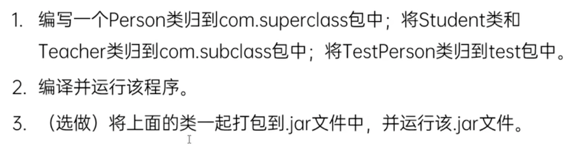

# Package Management

## package
### 作用
- 区分重命名
- 控制访问权限
- 管理项目结构

### 格式
- 写在文件中可执行代码的首行
- 规范：全小写，eg. com.thoughtworks.项目名.模块名

## import
- 用于确定导入类的位置（哪个包下的类）
- ' * ' 用于导入某包下的所有类和接口
- 同名类使用时，其中一个需要使用全类名
- import static 静态导包 (不建议过多使用，可读性差)
    ```
  import java.util.Date
  // import java.sql.Date
  
    // import com.thoughtworks.oo.Person.printInfo;
  // import com.thoughtworks.oo.Person.name;
  import static com.thoughtworks.Person.*;
  
  class PackageTest {
    public static void main(String[] args) {
    Date d1 = new Date(111);
    // Date d2 = new Date(111);
    java.sql.Date d2 = new java.sql.Date(111);
  
    // Person.printInfo();
    // Person.name;
    // 用*可以省略类名
    printInfo();
    System.out.println(name);
  }
  }
  ```
  ```
  package com.thoughtworks.oo;
  
  public class Person {
    public static String name;
    public static void printInfo() {
        System.out.printlin(this.getName());
    }
  } 
    ```
  
## 练习
- see PackagePractice.java 