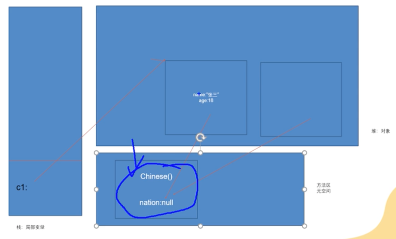

# 关键字Static "静态"

## 作用❓
- 用于修饰属性，方法，内部类，代码块

### static 修饰 属性 （静态变量/类变量）
- 当一个类里的一个属性的值一直是不变的，那么可以将该属性提取出来，作为静态属性；
- 静态属性是随着类被加载时一起被加载，类消失时一起消失，所以静态属性的声明周期最长
- 静态属性会被该类的所有对象**共享**，当一个对象修改了该属性值时，其他对象的该属性值也会被修改
- 静态变量是优先于对象存在的，也就是说即便类的对象没有被new出来时，该属性也可以被赋值调用，比如：
```
class StaticTest {
    public static void main(String[] args) {
        Chinese.nation = "China";
        sout(Chinese.nation); // "China"
    }
}

class Chinese{
    static String nation;  
}
```
- 静态变量和实例变量的区别有二：
  1. 声明周期不同
  2. 存储的位置不同

### static 修饰 方法 （静态方法/类方法）
- 随着类的加载而被加载
- 静态方法的存在优先于对象
- 通过"类名.类方法"调用
- 不能在静态方法里调用实例变量（非静态成员），因为静态方法加载时，对象还没有被创建，也就没有实例变量存在
- 静态方法中不能使用this和super